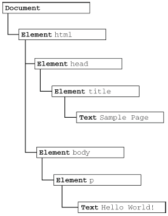
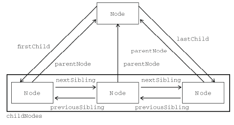

#DOM

> DOM(Document Object Model),文档对象模型 (DOM) 是HTML和XML文档的编程接口。它提供了对文档的结构化的表述，并定义了一种方式可以使从程序中对该结构进行访问，从而改变文档的结构，样式和内容。DOM 将文档解析为一个由节点和对象（包含属性和方法的对象）组成的结构集合。简言之，它会将web页面和脚本或程序语言连接起来。

##节点
DOM可以将任何HTML文档描绘成一个由多层节点构成的结构。节点分为几种类型，每种类型分别表示文档中不同的信息。每个节点都拥有自己的特性，同时也与其他节点存在某种关系，这种关系构成了文档中的层次，从而构成了文档树。

**简单的HTML：**

	<html>
		<head>
			<title>Sample Page</title>
		</head>
		<body>
			
Hello World!

		</body>
	</html>

**层次结构：**

Document文档节点，文档节点是HTML中的根节点，文档节点只有一个子节点，也就是html。

**节点类型**
所有的节点都继承自Node类型，所以所有节点类型都共享着相同的基本属性和方法，比如id、class等，每一种节点类型都有一个nodeType属性，用于表明节点的类型。
结点类型参见：[HTML DOM nodeType属性](http://www.w3school.com.cn/jsref/prop_node_nodetype.asp)

**节点关系**
文档中所有的节点之间都存在这样或那样的关系。节点间的各种关系可以用传统的家族关系来描述，相当于把文档树比喻成家谱。在HTML 中，可以将<body>元素看成是<html>元素的子元素；相应地，也就可以将<html>元素看成是<body>元素的父元素。而<head>元素，则可以看成是<body>元素
的同胞元素，因为它们都是同一个父元素<html>的直接子元素。

##常见的DOM操作

DOM提供了接口以便更容易操作DOM。

**查找元素**
- `getElementById`
- `getElementsByClassName`
- `getElementsByTagName`

**删除元素**
- `removeChild`

**其他操作**
- `createElement`
- `appendChild`
- `insertBefore` && `insertAfter`
- `innerHTML` && `innerText`
- `setAttribute` && `getAttribute`
- `style` && `getComputedStyle`

见[demo](./demo/dom)

##参考资料

- [Introducing the JavaScript DOM](http://www.elated.com/articles/javascript-dom-intro/)
- [MDN 文档对象模型 (DOM)](https://developer.mozilla.org/zh-CN/docs/Web/API/Document_Object_Model)
- JavaScript高级程序设计(第三版)
- [HTML DOM nodeType属性](http://www.w3school.com.cn/jsref/prop_node_nodetype.asp)
