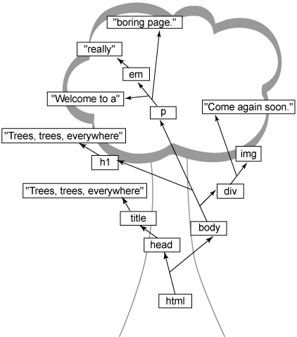
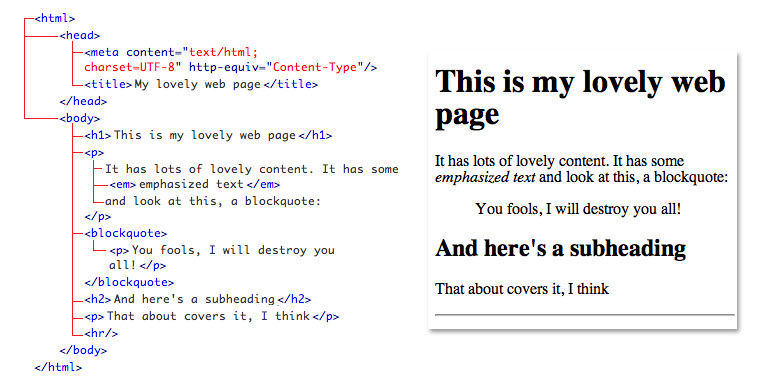
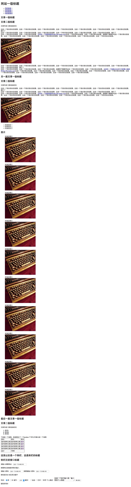

# HTML

##结构组成

- DOCTYPE：出现在网页源码的第一行就是DOCTYPE声明，这使得浏览器用什么标准和规则来渲染下面的HTML文档，不同的DOCTYPE声明可能导致渲染出来的页面有所不同。
- 文档树：一个HTML可以被认为是一个文档树，一棵树含有含多分支，那么文档树也是一样的，如图所示：

- 这就是一个简单的文档结构了，可以看到，里面包含了	`HEAD`和`BODY`两部分。
	- `HEAD`，头，包含描述这个文档的描述信息,`title`,`meta`等，还有脚本`script`、样式`link`、`style`等资源。 
	- `BODY`，身体，你能够在浏览器中看到的都在这里，也就是可视元素，`h1`~`h6`,`p`,`ul`等。

##常见标签 & 标签之间的区别

**常见标签**

- 文档标签(10 个)：

		<html>、<head>、<body>、<title>、<meta>、<base>、<style>、<link>、<script>、<noscript> 

- 框架标签(4个)：
- 
		<frame>、<frameset>、<iframe>、<noframes> 

- 3、布局标签(1个)：

		
 
- 4、表格标签(10 个)：

		<table>、<thead>、<tbody>、<tfoot>、<tr>、<td>、<th>、<col>、<colgroup>、<caption> 

- 表单标签(10 个)：

		<from>、<input>、<textarea>、<button>、<select>、<optgroup>、<option>、<label>、<fieldset>、<legend> 

- 列表标签(6个)：

		<ul>、<ol>、<li>、<dl>、<dt>、<dd> 

- 链接标签(1个)：

		<a> 

- 多媒体标签(5个)：

		、<map>、<area>、<object>、<param> 

- 文章标签：

		<h1> - <h6> 、
、 、、<bdo>、<pre>、<acronym>、<abbr>、<blockquote>、<q>、<ins>、<del>、<address> 

- 字体样式标签：

		<tt>、<i>、<b>、<big>、<small>、<em>、<strong>、<dfn>、<code>、<samp>、<kbd>、<var>、<cite>、、 

- 特殊标签(3个)：

		<!DOCTYPE>、<!-- -->、

**元素之间的区别**

按照布局的特性可以分为块级元素、内联元素和内联块级元素：
- 块级元素：block，总是在新的行开始，每一元素独站一行，宽度默认是父级元素的100%，比如：`div`、`h1`等。
- 内联元素：inline，和其他元素在同一行上，宽和高不可以设定，比如：`span`,`strong`，`a`等。
- 内联块级元素：inline-block，元素呈现是内联元素，保持在同一行，和inline的区别是可以设置宽高，比如：`img`、`button`、`input`、`select`。

##规范&语义化

**规范**：写Web页面就像我们建设房子一样，地基牢固，房子才不会倒。同样的，我们制作Web页面也是一样的，一个良好的HTML结构是制作一个网站的开始，良好的CSS只存在同样良好的HTML中。

- **DOCTYPE的声明：**统一使用严格型的`<!DOCTYPE html>`。
- **正确的代码缩进：**在平时的代码编辑中，应该使用缩进，提高代码的可读性。
- **正确的标签嵌套：**层级嵌套是有一定规范的，这个自己记住几点就行了：`td`应该放在`tr`当中，`dt`应该放在`dl`当中，`p`里面不能放`div`，内联元素里面不能放块级元素。
- **删除不必要的标签：**：比如下面一段代码：
		
		

			<ul>
				<li>item 0</li>
				<li>item 1</li>
			</ul>
		

	如果`ul`只是单独占一行，那么就可以删除div，避免不必要的嵌套，因为嵌套越深，浏览器渲染花的时间就会越长。

- **更好的命名：**代码即注释，我们应该按照功能块来给元素设置id或者class名，而不是按照元素的外观来命名，比如一个蓝色的导航栏，应该用`main-nav`、`sub-nav`来命名，而不是`blue-nav`，维护这段代码的人看见命名即可知道该块是做什么的。

- **语义化**
在写代码中，尽量使用合适的语义化标签，比如`h1`、`dl`、`nav`、`nav`,`footer`，`article`等要使搜索引擎收录我们的网页，其前提是要让搜索引擎的Spider能读懂我们的Web文件，搜索引擎Spider阅读网页的根据便是HTML规范，通过对HTML代码的分析，Spider才能判断网页内容，在此基础上才能判断针对相应关键词的相关性。另外，有效的HTML也可以保证Web页面可以在多种浏览器下被正确解释，避免同一个页面在不同的浏览器上显示不同的页面，同时，这对于提高网站的可用性方面也是有着极大好处的。

##练习&实践，如何写出一个规范的HTML文档

目的：了解HTML的定义、概念、发展简史，掌握常用HTML标签的含义、用法，能够基于设计稿来合理规划HTML文档结构，理解语义化，合理地使用HTML标签来构建页面。

按照下列图片，用语义化标签写出HTML结构，不用写CSS，可以使用HTML5的标签：

##参考资料

- [Mozilla Developer Network](Mozilla Developer Network "https://developer.mozilla.org/zh-CN/docs/Web/Tutorials")
- [Basic Structure of a Web Page](http://www.sitepoint.com/web-foundations/basic-structure-of-a-web-page/)
- [如何规范大型网站的HTML代码](http://www.mahaixiang.cn/html/648.html)
- [HTML+CSS基础课程](http://www.imooc.com/learn/9)
- [Baidu FE Task](http://ife.baidu.com/task/all)