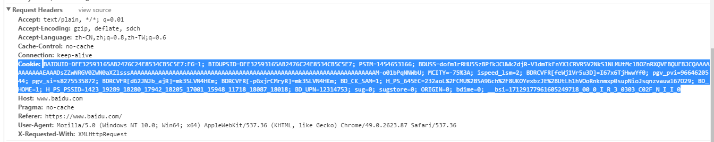

## HTTP

 `HTTP`是`Hyper Text Transfer Protocol`（超文本传输协议）的缩写。`HTTP`是客户端浏览器或其他程序与Web服务器之间的应用层通信协议。在Internet上的Web服务器上存放的都是超文本信息，客户机需要通过`HTTP`协议传输所要访问的超文本信息。`HTTP`包含命令和传输信息，不仅可用于Web访问，也可以用于其他因特网/内联网应用系统之间的通信，从而实现各类应用资源超媒体访问的集成。

**OSI七层模型**

|:----:|:----:|:----:|
|**OSI中的层**|**功能**|**TCP/IP协议族**|
|应用层|文件传输、电子邮件、文件服务、虚拟终端|
|表示层|数据格式化、代码转换、数据加密|--|
|会话层|解除或建与别的接点的联系|--|
|传输层|提供端对端的接口|TCP、UDP|
|网络层|为数据包选择路由|IP、ICMP、RIP、OSPF、BGP、IGMP|
|数据链路层|传输有地址的帧以及错误检测功能|SLIP、CSLIP、PPP、ARP、RARP、MTU|

**HTTP请求响应模型**
HTTP协议永远都是客户端发起请求，然后服务器送回相应。

**过程**

	客户端 ----- 通过socket建立连接 ----- 服务器
    客户端 -----  请求 -----> 服务器
    客户端 <----- 响应 ------ 服务器
    客户端 -----  断开 ------ 服务器
    下一次连接.......

**TCP/IP 握手**

`TCP(Transmission Control Protocol)`　传输控制协议，`HTTP`是建立在TCP/IP协议基础之上，为了能够进行有效的稳定的传输，TCP会进行三次握手，三次握手成功之后进行数据传输。

(*图中flag说明:SYN包表示标志位syn=1,ACK包表示标志位ack=1,SYN+ACK包表示标志位syn=1,ack=1*)

*术语解释：*

|----|----|
|Source Port / Destination Port | 客户端口(源端口)和服务器端口（目的端口）|
|Sequence Number(seqNumber)|般由 客户端发送，用来表示报文段中第一个数据字节在数据流中的序号，主要用来解决网络包乱序的问题。
|Acknowledgment Number(ACK)|即就是用来存放客户端发来的seqNumber的下一个信号(seqNumber+1). 只有当 TCP flags中的ACK为1时才有效. 主要是用来解决不丢包的问题。|

*TCP flags*

|----|----|
|URG|`Urget`,当值为1时，用来保证TCP连接不被中断, 并且将该次TCP内容数据的紧急程度提升(就是告诉电脑，赶快把这个给resolve了)|
|ACK|`Acknowledgment`,通常是服务器端返回的。 用来表示应答是否有效。 1为有效，0为无效|
|PSH|`PUSH`,当数据包得到后，立马给应用程序使用(PUSH到最顶端)|
|RST|`REST`,用来确保TCP连接的安全。 该flag用来表示 一个连接复位的请求。 如果发生错误连接，则reset一次，重新连。当然也可以用来拒绝非法数据包。|
|SYN|`SYNC`,同步的意思,通常是由客户端发送，用来建立连接的。第一次握手时: SYN:1 , ACK:0. 第二次握手时: SYN:1 ACK:1|
|FIN|`FINISH`,用来表示是否结束该次TCP连接。 通常当你的数据发送完后，会自动带上FIN 然后断开连接|

*过程*

- **第一次握手:**客户端向服务器发送一个SYN包，并且添加上seqNumber(假设为x),然后进入SYN_SEND状态，并且等待服务器的确认。(`000010`)
	
		URG      _ _ 0 _  _ _ _ _
		ACK      _ _ _ 0  _ _ _ _
		PSH      _ _ _ _  0 _ _ _
		RST      _ _ _ _  _ 0 _ _
		SYN      _ _ _ _  _ _ 1 _
		FIN      _ _ _ _  _ _ _ 0

- **第二次握手:**服务器接受SYN包，并且进行确认，如果该请求有效，则将TCP flags中的ACK 标志位置1， 然后将AckNumber置为(seqNumber+1)，并且再添加上自己的seqNumber(y), 完成后，返回给客户端.服务器进入SYN_RECV状态.(这里服务端是发送SYN+ACK包)(`010010`)

		URG      _ _ 0 _  _ _ _ _
		ACK      _ _ _ 1  _ _ _ _
		PSH      _ _ _ _  0 _ _ _
		RST      _ _ _ _  _ 0 _ _
		SYN      _ _ _ _  _ _ 1 _
		FIN      _ _ _ _  _ _ _ 0

- **第三次握手:**客户端接受ACK+SYN报文后，获取到服务器发送AckNumber(y), 并且 将新头部的AckNumber变为(y+1).然后发送给服务器，完成TCP3次连接。此时服务器和客户端都进入ESTABLISHED状态.(`01000`)

		URG      _ _ 0 _  _ _ _ _
		ACK      _ _ _ 1  _ _ _ _
		PSH      _ _ _ _  0 _ _ _
		RST      _ _ _ _  _ 0 _ _
		SYN      _ _ _ _  _ _ 0 _
		FIN      _ _ _ _  _ _ _ 0

**HTTP 状态码**

    
	　　　　100 继续
	　　　　101 分组交换协

	　　　　200 OK
	　　　　201 被创建
	　　　　202 被采纳
	　　　　203 非授权信息
	　　　　204 无内容
	　　　　205 重置内容
	　　　　206 部分内容

	　　　　300 多选项
	　　　　301 永久地传送
	　　　　302 找到
	　　　　303 参见其他
	　　　　304 未改动
	　　　　305 使用代理
	　　　　307 暂时重定向

	　　　　400 错误请求
	　　　　401 未授权
	　　　　402 要求付费
	　　　　403 禁止
	　　　　404 未找到
	　　　　405 不允许的方法
	　　　　406 不被采纳
	　　　　407 要求代理授权
	　　　　408 请求超时
	　　　　409 冲突
	　　　　410 过期的
	　　　　411 要求的长度
	　　　　412 前提不成立
	　　　　413 请求实例太大
	　　　　414 请求URI太大
	　　　　415 不支持的媒体类型
	　　　　416 无法满足的请求范围
	　　　　417 失败的预期

	　　　　500 内部服务器错误
	　　　　501 未被使用
	　　　　502 网关错误
	　　　　503 不可用的服务
	　　　　504 网关超时
	　　　　505 HTTP版本未被支持

**session、cookie**

`HTTP`协议，是一种无状态协议，就是说客户端发送一次请求，服务器端接收请求，经过处理返回给客户端信息，然后客户端和服务器端的链接就断开了，为了维护他们之间的链接，让服务器知道这是前一个用户发送的请求，必须在一个地方保存客户端的信息，有2中解决方案，一是在客户端保存，二是在服务器端保存。

- 在客户端保存：cookie,如果用户禁用了cookie，只能通过重写的方式在每次请求后边加上一个参数来保存客户端的信息。cookie的结构是键值对形式，`key=value`，每个键值对之间用分号隔开,	`key1=value1;key2=value2`，在每次请求的时候，请求会带上这个cookie。每个cookie可以设置过期时间和作用域。

- 在服务器端保存：session，由于`HTTP`协议是无状态的，所以会通过session id来区分客户端，默认是依赖cookie来实现的，如果客户端禁用了cookie，那么会通过URL重写来实现，比如：`http://www.toursforfun.com?JSESSIONID=xxxxxx`。

##参考资料

- [深入理解HTTP协议（转）](http://www.blogjava.net/zjusuyong/articles/304788.html)
- [HTTP协议简介](http://www.cnblogs.com/linzheng/archive/2011/01/25/1944914.html)
- [当···时发生了什么？](https://github.com/skyline75489/what-happens-when-zh_CN)
- [网页打开时都发生了什么？我被吓着了](http://www.tuicool.com/articles/JBfi2ef "网页打开时都发生了什么？我被吓着了")
- [前端进阶-让你升级的网络知识](http://www.liuhaihua.cn/archives/258920.html "前端进阶-让你升级的网络知识")