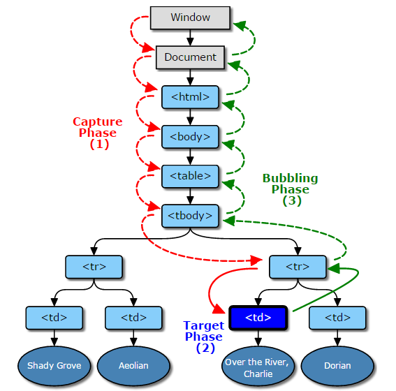

# JavaScript
>JavaScript一种直译式脚本语言，是一种动态类型、弱类型、基于原型的语言，内置支持类型。它的解释器被称为JavaScript引擎，为浏览器的一部分，广泛用于客户端的脚本语言，最早是在HTML（标准通用标记语言下的一个应用）网页上使用，用来给HTML网页增加动态功能。

##基础数据类型
js的基本数据类型有五种：null、undefined、number、string、boolean

引用数据类型：数组、对象

## 函数
> 函数是由事件驱动的或者当它被调用时执行的可重复使用的代码块。

**函数声明**
**匿名函数**
**自执行函数**

JavaScript 变量的生命期从它们被声明的时间开始。
局部变量会在函数运行以后被删除。
全局变量会在页面关闭后被删除。

## 常见API
**字符换：**substring、substr、split、replace、match
**数组：**push、put、shift、unshift、slice、splice、join、sort

		function split(arr, interval) {
			var result = [];
			for (var i = 0; i < arr.length; i += interval) {
				result.push(arr.slice(i, i + interval));
			}
			return result;
		};

##正则表达式
>正则表达式，又称正规表示法、常规表示法（英语：Regular Expression，在代码中常简写为regex、regexp或RE），计算机科学的一个概念。正则表达式使用单个字符串来描述、匹配一系列符合某个句法规则的字符串。在很多文本编辑器里，正则表达式通常被用来检索、替换那些符合某个模式的文本。

**正则表达式声明**
- 字面量
- new RegExp(regStr,option)
- `\d`、`\w`、`\s`、`.`、`?`、`*`、`^`、`$`、`[]`、`{}`、
- 修饰符：`i`、`g`、`m`
- 常用正则表达式:tel、email、number，实现trim函数
- exec、match

[正则教程](http://www.jb51.net/tools/zhengze.html)

##常用技巧

http://blog.sae.sina.com.cn/archives/2291

##事件模型
> JavaScript 与HTML 之间的交互是通过事件实现的。事件，就是文档或浏览器窗口中发生的一些特定的交互瞬间。可以使用侦听器（或处理程序）来预订事件，以便事件发生时执行相应的代码。这种在传统软件工程中被称为观察员模式的模型，支持页面的行为（JavaScript 代码）与页
面的外观（HTML 和CSS 代码）之间的松散耦。

**事件流**
事件流描述的是从页面中接收事件的顺序。

**冒泡**
TODO

**默认事件**
TODO

**捕获**
TODO

**兼容处理**
事件注册
获取事件源
addEventListener(type, listener, useCapture); 
attachEvent(type,listener)

**事件代理**
TODO

[demo](./demo/js/)

##作用域

>任何程序设计语言都有作用域的概念，简单的说，作用域就是变量与函数的可访问范围，
即作用域控制着变量与函数的可见性和生命周期。在JavaScript中，变量的作用域有全局作用域和局部作用域两种。

**全局作用域（Global Scope）**
在代码中任何地方都能访问到的对象拥有全局作用域，一般分为以下几种情形：
- 最外层函数和在最外层函数外面定义的变量拥有全局作用域
    
    
    var authorName="Leon.Cai";
    function doSomething(){
        var blogName="Leon's Blog";
        function innerSay(){
            alert(blogName);
        }
        innerSay();
    }
    console.log(authorName); 
    console.log(blogName); 
    doSomething();
    innerSay();

- 所有末定义直接赋值的变量自动声明为拥有全局作用域（非严格模式下）
- 一般情况下，window对象的内置属性都拥有全局作用域，
例如window.name、window.location、window.top等等（浏览器环境下）

**局部作用域**
和全局作用域相反，局部作用域一般只在固定的代码片段内可访问到，最常见的例如函数内部，
所有在一些地方也会看到有人把这种作用域称为函数作用域，例如下列代码中的blogName和函数innerSay都只拥有局部作用域。
    
    var authorName="Leon.Cai";
    function doSomething(){
        var blogName="Leon's Blog";
        function innerSay(){
            alert(blogName);
        }
        innerSay();
    }

    console.log(blogName); 
    innerSay();

##作用域链
>在JavaScript中，函数也是对象，实际上，JavaScript里一切都是对象。函数对象和其它对象一样，
拥有可以通过代码访问的属性和一系列仅供JavaScript引擎访问的内部属性。
其中一个内部属性是[[Scope]]，由ECMA-262标准第三版定义，
该内部属性包含了函数被创建的作用域中对象的集合，这个集合被称为函数的作用域链，
它决定了哪些数据能被函数访问。

当一个函数创建后，它的作用域链会被创建此函数的作用域中可访问的数据对象填充。

    function add(num1,num2) {
        var sum = num1 + num2;
        return sum;
    }
    var total = add(5,10);
    console.log(total);
执行此函数时会创建一个称为“运行期上下文(execution context)”的内部对象，
运行期上下文定义了函数执行时的环境。每个运行时上下文会维护一个自己的作用域链，
这个作用域链是由函数的[[Scope]]初始化而来。

它们共同组成了一个新的对象，叫“活动对象(activation object)”，该对象包含了函数的所有局部变量、
命名参数、参数集合以及this，然后此对象会被推入作用域链的前端，当运行期上下文被销毁，
活动对象也随之销毁。

**代码优化**

    function changeColor(){
        var el = document.getElementById("targetCanvas");
        document.getElementById("btnChange").onclick=function(){
            el.style.backgroundColor="red";
        };
    }

##闭包
“官方”的解释是：所谓“闭包”，指的是一个拥有许多变量和绑定了这些变量的环境的表达式
（通常是一个函数），因而这些变量也是该表达式的一部分。

    function a(){
        var i = 0;
        function b(){
            console.log( ++i);
        }
        return b;
    }
    var c = a();
    c();
        
**主旨：**
>If you can't explain it to a six-year-old, you really don't understand it yourself.

**正文**

    //从前：
    //有一位公主......
    function princess() {
        /*
        *她生活在一个充满奇幻冒险的世界里, 她遇到了她的白马王子, 带着他骑着独角兽开始周游这个世界，
        *与巨龙战斗，巧遇会说话的动物，还有其他一些新奇的事物。
        */

        var adventures = [];

        /*白马王子*/
        function princeCharming() {
            /* ... */ 
        } 

        var unicorn = { /* ... */ },          //独角兽
            dragons = [ /* ... */ ],         //龙
            squirrel = "Hello!";            //松鼠

        adventures.push(unicorn, dragons, squirrel, ....);
    
        /*但是她不得不回到她的王国里，面对那些年老的大臣。*/
        
        return {
            /*她会经常给那些大臣们分享她作为公主最近在外面充满奇幻的冒险经历。*/
            story: function() {
                return adventures[－－adventures.length];
            }
        };
    }
    
    但是在大臣们的眼里，总是认为她只是个小女孩......
    
    var littleGirl = princess();
    
    ....讲的是一些不切实际，充满想象的故事
    
    littleGirl.story();
    
    即便所有大臣们知道他们眼前的小女孩是真的公主，但是他们却不会相信有巨龙或独角兽，
    因为他们自己从来没有见到过。大臣们只会觉得它们只存在于小女孩的想象之中。

    但是我们却知道小女孩述说的是事实.......

**内存泄露及解决方案**
垃圾回收机制：标记清除，引用计数

**优缺点**
优点：
- 可以让一个变量常驻内存 (如果用的多了就成了缺点
- 避免全局变量的污染
- 私有化变量

缺点：
- 因为闭包会携带包含它的函数的作用域，因此会比其他函数占用更多的内存
- 引起内存泄露

##原型(prototype)
>在JavaScript中，所有的对象都是基于 Object；
所有的对象都继承了Object.prototype的属性和方法，
它们可以被覆盖（除了以null为原型的对象，如 Object.create(null)）。
例如，新的构造函数的原型覆盖原来的构造函数的原型，提供它们自己的 toString() 方法。
对象的原型的改变会传播到所有对象上，
除非这些属性和方法被其他对原型链更里层的改动所覆盖。

- `prototype`
- `__proto__`
- `constructor`
- `Object.__proto__`

    var A = function(){}
    var a = new A();
    a.__proto__ === A.prototype;
    a.constructor === A;

		var Animal = function(){
			this.name = "this is a Animal!";
		};
	
		Animal.prototype = {
			constructor : Animal,
			run : function(){
				console.log("Animal can run!");
			},
			eat : function(){
				console.log("Animal can eat!");
			}
		};
		
		var Cat = function(){

		}
		

	
 
##原型链

##继承

    基础语法，字符串、数字、数组等常见的操作
    事件模型
    浏览器之间的差异以及解决办法
    常见技巧
    简单的设计模式
    闭包、原型链、继承
    正则表达式
    常见的库、框架简介，jQuery,angularjs
    js对DOM的操作
    编码规范
    练习实践，常见的界面交互

##参考

- [Learning JavaScript Design Patterns](https://addyosmani.com/resources/essentialjsdesignpatterns/book/)
- [45个实用的JavaScript技巧、窍门和最佳实践](http://blog.sae.sina.com.cn/archives/2291)
- [How do JavaScript closures work?](http://stackoverflow.com/questions/111102/how-do-javascript-closures-work)
- [廖雪峰－javascript基础教程] (http://www.liaoxuefeng.com/wiki/001434446689867b27157e896e74d51a89c25cc8b43bdb3000/00143449934543461c9d5dfeeb848f5b72bd012e1113d15000)
- [JavaScript 开发进阶：理解 JavaScript 作用域和作用域链](http://www.cnblogs.com/lhb25/archive/2011/09/06/javascript-scope-chain.html)
- [Javascript prototype(JS原型)深入理解](http://blog.baiwand.com/?post=209)
